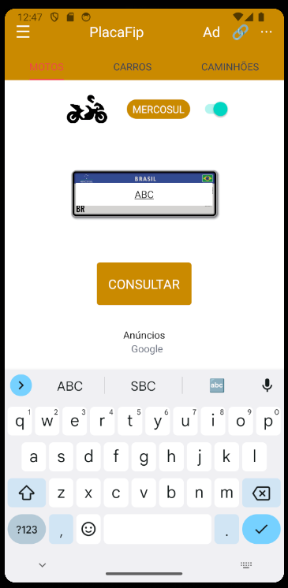
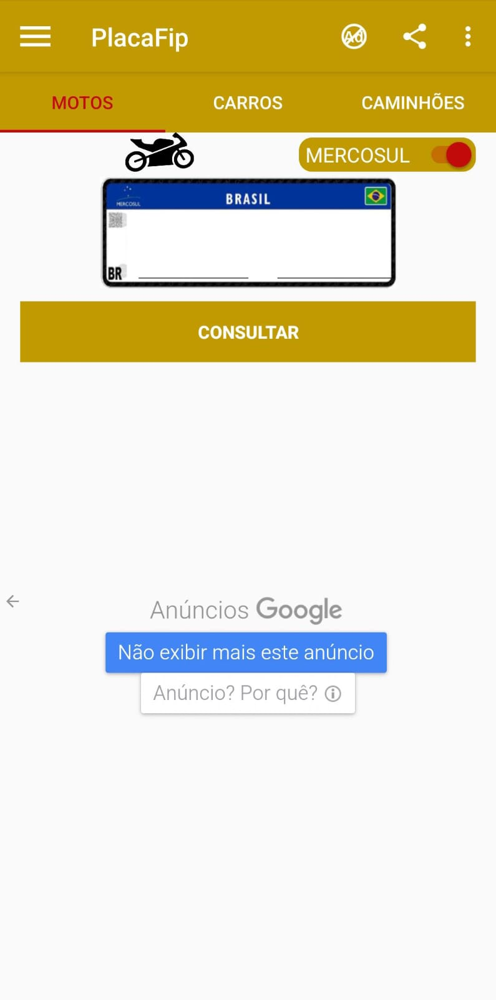

# PPDM - Gerenciamento de Recursos em Dispositivos Móveis

Este projeto é parte do curso de Gerenciamento de Recursos em Dispositivos Móveis e demonstra a utilização da biblioteca NativeWind no React Native para estilização de componentes utilizando Tailwind CSS. A aplicação reproduz uma tela de um aplicativo de consulta de placas, similar ao aplicativo PlacaFip.

## Funcionalidades

- **Navegação entre abas**: Motos, Carros, Caminhões.
- **Entrada de texto na imagem da placa**: Campo de texto para digitação da placa.
- **Botão de consulta**: Realiza a consulta da placa digitada.
- **Personalização com Tailwind CSS**: Estilos aplicados utilizando classes do Tailwind CSS.

## Tecnologias Utilizadas

- **React Native**: Framework para desenvolvimento mobile.
- **Expo**: Plataforma para desenvolvimento rápido de aplicativos React Native.
- **NativeWind**: Biblioteca para uso de Tailwind CSS no React Native.
- **Tailwind CSS**: Framework de utilitários CSS para estilização rápida.

## Como Executar

1. Clone o repositório:
   ```bash
   git clone https://github.com/RafaelSedor/PPDM_Gerenciamento_de_recursos_dispositivos_moveis
   cd PPDM_Gerenciamento_de_recursos_dispositivos_moveis
   ```

2. Instale as dependências:
   ```bash
   yarn install
   ```

3. Inicie o projeto:
   ```bash
   yarn start expo
   ```

## Estrutura do Projeto

- **App.tsx**: Ponto de entrada da aplicação.
- **Home.tsx**: Componente principal contendo a interface da aplicação.
- **global.css**: Estilos globais utilizando Tailwind CSS.
- **Configurações**: Arquivos de configuração do Tailwind e Babel para suporte ao NativeWind.

## Desafios Encontrados

- **Espaçamento e alinhamento**: Ajustar os espaçamentos entre elementos para garantir um layout agradável.
- **Campo de texto na placa**: Posicionar corretamente o campo de texto sobre a imagem da placa.
- **Estilização das abas de navegação**: Destacar a aba ativa com a linha vermelha.
- **Personalização do switch**: Ajustar o componente switch para combinar com o design original.

## Prints das Telas

- **Tela reproduzida**:
  
- **Tela do aplicativo original**:
  

